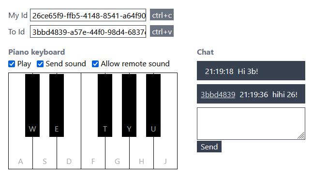

## Websocket piano and chat

Tutorial project to work with WebSockets to create a remote piano and chat using NodeJs.

On the frontend are used native browser WebSockets API, Vue3 and Tailwind, and Vite as bundler. To play sound Tone library is used.

On the backend ws library is used to create WebSockets server.

On WS connection every client takes its uuid from server, with this address another client can sand message to it using server, chat message or sound key command.

